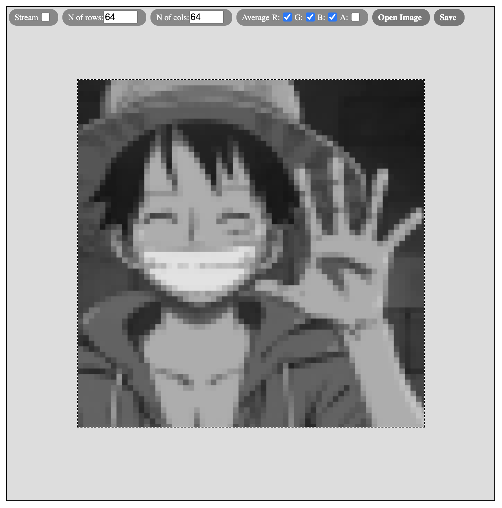
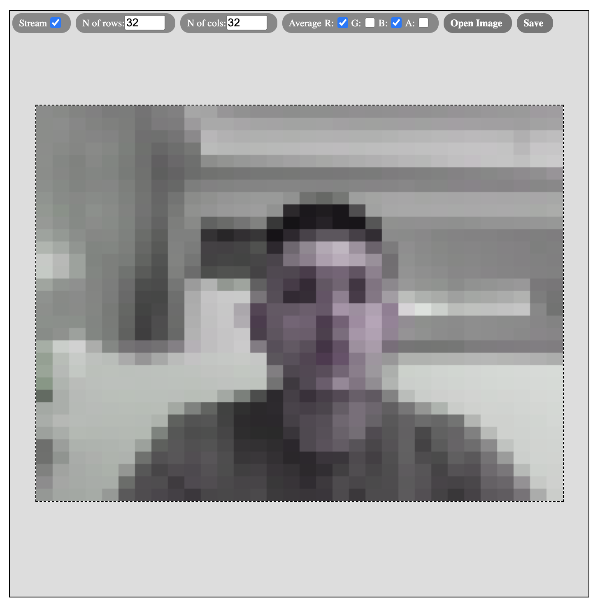

## im-d (image-distortion)

Preview of Default UI processing a user-chosen photo:

Preview of Default UI processing the stream of the video camera:

## How to use

Currently, the only way to use it, is to import the minified file. After thar, the API will be available through the `window.imD` object.

The `window.imD.createDefaultUI` method is the main one, used in the previews above. Look its [JS usage here](./examples/default-ui/script.js).

The `window.imD.runDistortion` method is the method to call if you had manually implemented a custom UI.

The `window.imD.loadImageFromInputFile` methos is an auxiliary method.

Their arguments and defaults can be seen in the [/src/index.js](./src/index.js) file

## Development

What I've used to develop:

- BEM methodology with SASS in the HTML of Default UI
- Extended eslint rules from airbnb-base in JS files
- Babel (using core-js@3 + generator-runtime) to get the better out of JS
- Webpack to bundle the output minified file
